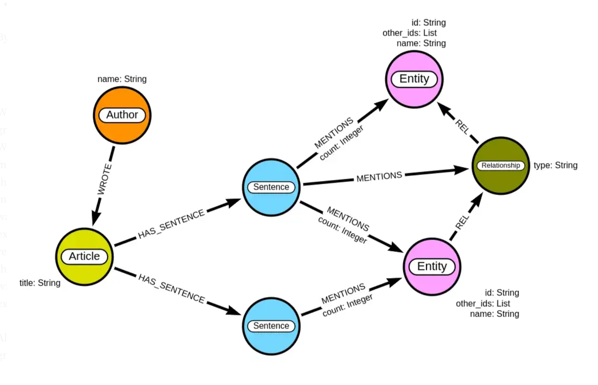

# Google Search

### "NLP huggingface analysis of document to knowledge graph"
- [Kaggle KG and NLP Tutorial](https://www.kaggle.com/code/pavansanagapati/knowledge-graph-nlp-tutorial-bert-spacy-nltk/notebook) 
  > Good overview, has code, explains knowledge Graphs, NetworkX, spaCy, BERT, NLTK

- [Construct a biomedical knowledge graph with NLP](https://towardsdatascience.com/construct-a-biomedical-knowledge-graph-with-nlp-1f25eddc54a0)

  > Starts with reading PDF documents with OCR, which we may not need. Using Neo4j. Below the KG schema is shown. It seems close to our objective. Has Colab notebook and github. 

- [Learn Knowledge Graphs - Three-Part Series](https://medium.com/@preeti.chauhan8/lets-learn-a-z-of-knowledge-graphs-one-step-at-a-time-part-1-introduction-to-basic-concepts-e17d821fb38c) 

> Impressive KG overview, fairly current (Nov 2022), has detailed code, no HF/BERT/etc, no PDF

- [Semantic Search via Knowledge Graphs in Python](https://medium.com/mlearning-ai/semantic-search-via-knowledge-graphs-cc9da99dab4d)

> Uses spaCy, promising by PhD candidate at GMU in Krakow, should explore what PubMed MEDLINE is doing with KG, 

### ...And so on... 
